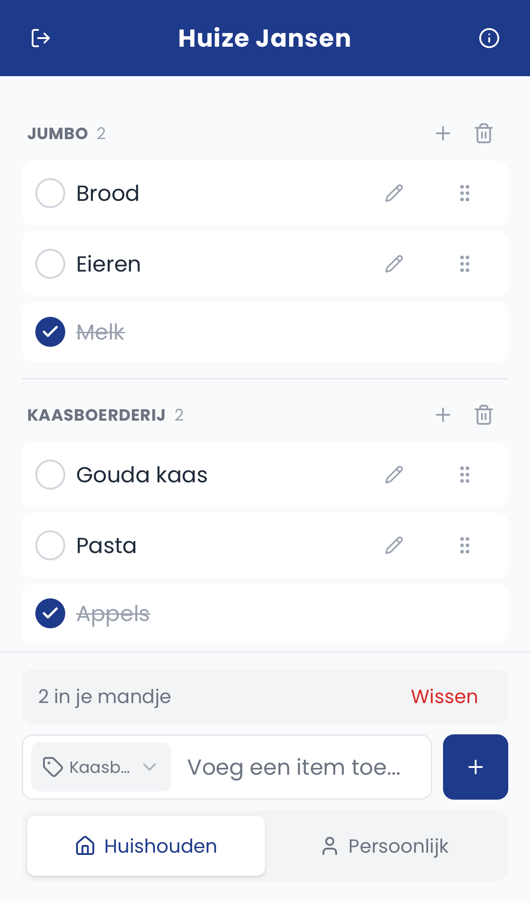

<h1 align="center">Mandje 🧺</h1>
<p align="center">A shared grocery list for households — built as a real app my household actually uses, not a portfolio toy.</p>

<p align="center">
  
</p>

<p align="center">
  <a href="https://household-app-seven.vercel.app">Live demo →</a>
</p>

## What it does

Two or more people share a household. Anyone can add items, drop them into categories, and check them off while shopping — checked items stay visible (struck through, sunk to the bottom of their category) so the whole basket is a glance away, not hidden in a "done" tab. Everyone's phone stays in sync without a manual refresh. Each person also gets a personal list alongside the shared one.

Installable as a PWA; the target device is a phone in a shopping aisle, not a desktop browser.

## Features

- Shared household list + personal list, toggled with one tap
- Categories with drag-and-drop, inline rename, swipe-to-delete
- Check off in place, undo on delete/clear
- Quick-add with a sticky "add to this category" picker
- Join a household via a shareable code; members list on the info page
- Real-time-ish sync across devices (polling, tuned to skip mid-edit and no-op updates)
- Installable PWA with offline-capable service worker

## Stack

Next.js 15 (App Router) · React 19 · TypeScript · Prisma + PostgreSQL (Neon) · NextAuth 5 · Tailwind CSS 4 + shadcn/ui · dnd-kit · Zod · deployed on Vercel, package-managed with Bun.

## Running it locally

```bash
bun install
bun run db:up      # postgres in docker
bun run db:migrate  # apply schema
bun run db:seed     # user "Tijn" / password "password"
bun run dev
```

Copy `.env.example` to `.env` first. `bun run typecheck` and `bun run lint` run automatically on commit via husky.
